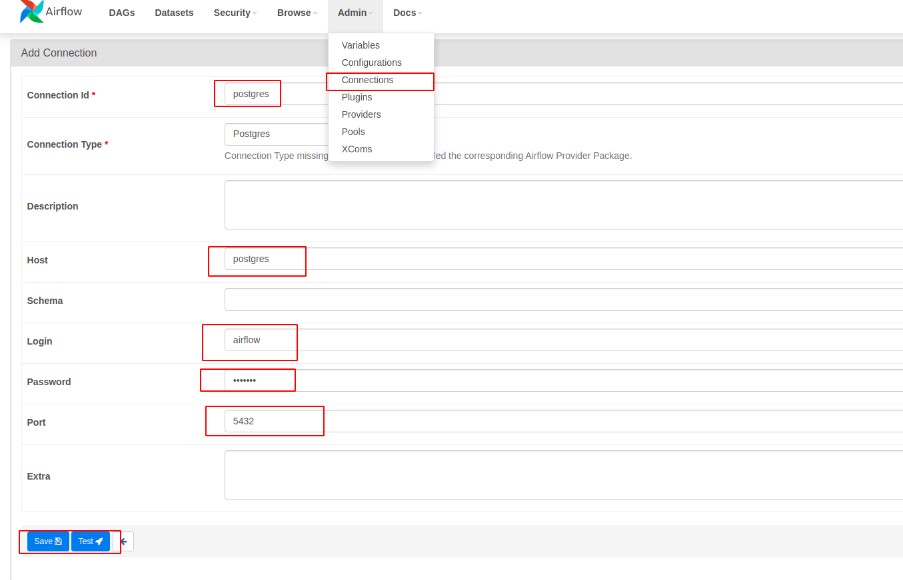

- `docker compose --profile flower up`
- `docker compose up airflow-init`
- `docker compose up`
- Airflow UI: http://localhost:8080/ . user: `airflow`, pass `airflow`
- CONFIG POSTGRE ON AIR FLOW UI:

- DEBUG TASK:

-- `docker exec -it airflow-lab-airflow-scheduler-1 bash`

-- ` airflow tasks test <dag_id> <task_id>`

-- ` airflow tasks test postgres_operator_dag get_all_pets`

